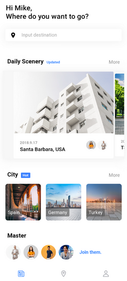
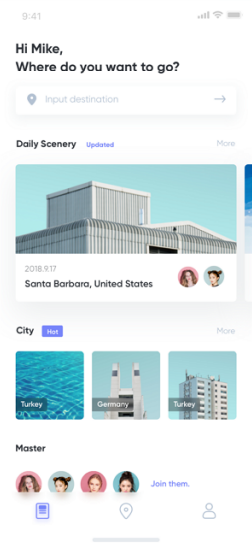

# Clone-Layout-Ionic

## Sistemas Distribuídos e Mobile activity
The professor of this curricular unit (discipline) of the graduation in Computer Science asked to clone the layout of a mobile application (images below) that does not have any functionality, just static design.

I tried to reproduce the layout as closely as possible to the original, except for the photos of places and people (there is a credits section at the end of the document for the creators and artists who took the photos). Although this project does not involve building a functional application and it did not turn out perfectly identical to the original, it was still a lot of work and I may consider adding simple functionalities in the future to make this project more interesting.

### Technologies used
- Ionic Framework
- Angular
- Visual Studio Code

### Print screen
| cloneLayout | Original layout |
| --- | --- |
|  |  |

### Credits
- [city-1](https://br.freepik.com/fotos-gratis/bela-vista-da-plaza-de-espana-em-sevilha-na-espanha_15696553.htm#query=places&position=8&from_view=search&track=sph): Image by wirestock on Freepik
- [city-2](https://br.freepik.com/fotos-gratis/cidade-grande_1242678.htm#query=places&position=7&from_view=search&track=sph): Image by evening_tao on Freepik
- [city-3](https://br.freepik.com/fotos-gratis/excelente-vista-da-cidade-a-noite_973439.htm#query=places&position=1&from_view=search&track=sph): Image by onlyyouqj on Freepik
- [daily-scenery-1](https://br.freepik.com/fotos-gratis/foto-de-baixo-angulo-da-fachada-de-um-edificio-moderno-branco-sob-um-ceu-azul-claro_17465724.htm#query=building&position=0&from_view=search&track=sph): Image by wirestock on Freepik
- [daily-scenery-2](https://br.freepik.com/fotos-gratis/construcoes-modernas_1175703.htm#query=places&position=12&from_view=search&track=sph): Image by evening_tao on Freepik
- [friend-1](https://br.freepik.com/fotos-gratis/retrato-de-uma-jovem-bonita-em-pe-na-parede-cinza_13813927.htm#query=person&position=2&from_view=search&track=sph): Image by diana.grytsku on Freepik
- [friend-2](https://br.freepik.com/fotos-gratis/velho-empresario-de-sucesso-de-terno-e-oculos-parecendo-confiante_10863174.htm#query=person&position=1&from_view=search&track=sph): Image by cookie_studio on Freepik
- [friend-3](https://br.freepik.com/fotos-gratis/homem-de-camiseta-preta-sorrindo-docemente-na-parede-laranja_15696238.htm#query=person&position=10&from_view=search&track=sph): Image by lookstudio on Freepik
- [friend-4](https://br.freepik.com/fotos-gratis/retrato-da-bela-empresaria-executiva-casual-smart-olhando-para-a-camera-e-sorrindo-feliz-na-noite-do-escritorio-moderno-no-local-de-trabalho_15116076.htm#query=person&position=6&from_view=search&track=sph): Image by tirachardz on Freepik
